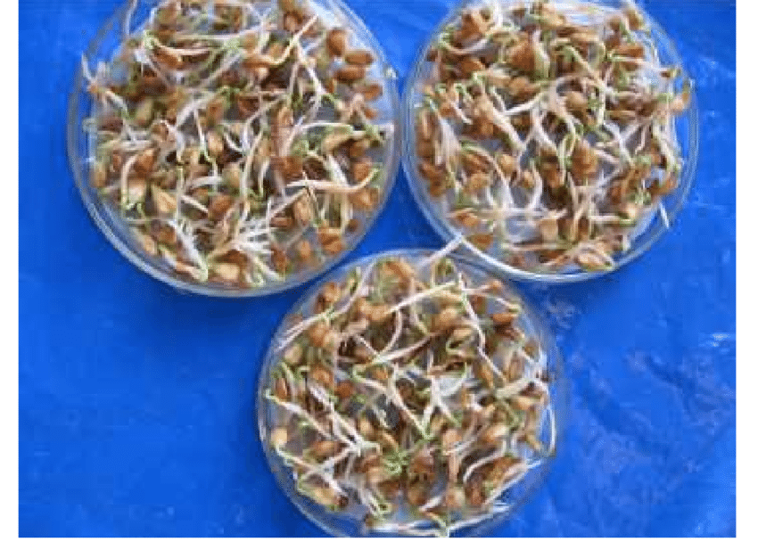

```{r setup, include=FALSE}
knitr::opts_chunk$set(echo = TRUE)
```

## Mungbean Sprout Growth

Mungbeans were sprouted in 3 petri dishes at varying temperatures.  The germination%, length, and weight were measured at 24 hour intervals for 5 days.  With this data, we can determine if the temperature had an effect on the growth.  We would also like to determine the ideal temperature of those tested.  The source of the data was @article.

### Temperature & Light Conditions

The 3 temperatures that are being compared are 25&deg;C, 30&deg;C, and Ambient (ranging from 21&deg;C - 31&deg;C).  Seeds were grown at constant temperature by placing them in a controlled incubator.  Seeds were grown in darkness for this set of data.

### Growing Medium

The seeds were grown in petri dishes, placed on a wet tissue used to keep them moist.  There were 10 seeds per sample.  Seeds were soaking in water for 12 hours prior to placing them in the dishes which was determined to be to optimal time.


{#id .class width=350 height=450px}

```{r mungbeans, echo=FALSE, message=FALSE}
#install.packages("tidyverse")
library(tidyverse)
library(knitr)
mungbeans_df<-read.csv("mungbean.csv")

kable(mungbeans_df, caption="measured length & weight")

#print("Summary of Data")
#summary(mungbeans_df)
```


## Growth Plot

This graph seems to show that the Ambient temperature produced the longest sprouts.  However, the study concluded that the change in length from 24 hours to 120 hours was greatest at 30&deg;C.  Since all were started from seeds, if maximum length was the desired outcome and 0 was your starting length, ambient growing conditions seem fine.

In order to prove that the @article study was correct, one would have to show the %difference in length from 24 hours -> 120 hours.      

```{r growthplot, echo=FALSE,fig.width=6,fig.height=4}

ggplot(data=mungbeans_df, aes(x=duration, y=length, group=temp)) +
  geom_line(aes(color=temp, linetype=temp))+
  geom_point(aes(color=temp)) +
  labs(title="Plot of Length by Time",x="Time (hours)", y = "Sprout Length (cm)")
```

## Weight Plot

This plot shows that the 25&deg;C is the optimal temperature to achieve maximum weight. The starting weight was not equal.  It may be necessary to scale these weights so see the a more accurate % increase at the 3 temps. The final weight for the samples grown at 25&deg;C was the greatest but the initial starting weight was the lowest for that sample.  This means the actual weight increase was more than shown on this plot, given equal weight samples.


```{r weightplot, echo=FALSE,fig.width=6,fig.height=4}
ggplot(data=mungbeans_df, aes(x=duration, y=sproutwt, group=temp)) +
  geom_line(aes(color=temp, linetype=temp))+
  geom_point(aes(color=temp)) +
  labs(title="Plot of Fresh Weight by Time",x="Time (hours)", y = "Sprout Weight (g)")

## DATA Manipulation required for Analysis
## make a new df that has the temp as columns

length_df<-mungbeans_df %>% 
  select(temp, duration, length) %>%
  pivot_wider(names_from=temp, values_from=length)

## normalize the columns for the 3 temps
scaled_df <- length_df %>% mutate_at(c("Ambient", "25", "30"), ~(scale(.) %>% as.vector))

kable(length_df, caption="Lengths Compared at 3 Temps")
```

At this point, I would like to perform a linear regression test to confirm that 30&deg;C is not the best temperature for growing these sprouts if maximum length was the only consideration.

```{r normalize, echo=FALSE}
#kable(scaled_df, caption="Normalized Data")

#ggplot(data=mungbeans_df, aes(x=duration, y=sproutdrywt, group=temp)) +
#  geom_line(aes(color=temp, linetype=temp))+
#  geom_point(aes(color=temp)) +
#  labs(title="Plot of Dry Weight by Time",x="Time (hours)", y = "Sprout Weight (g)")
```
\pagebreak
# Linear Model
temperature and duration in a linear model:
```{r linear_model, echo=FALSE, comment=NA}

# strip names and convert to 2 decimal places accuracy
roundcoef<-function(x){
  return(c(unname(format(round(x, 2), nsmall = 2)),"cm"))
}

lm_mung<- lm(data=mungbeans_df, formula=length~temp+duration)
cat("We create a linear regression model with the formula=length~temp+duration")
lm_mung$coefficients
cat("temp30 and tempAmbient are relative to a temperature of 25, so the length of plants grown")
cat(c("with a temperature of 30 is lower than 25 by",roundcoef(lm_mung$coefficients["temp30"]),"."))

cat(c("The length at Ambient temperature is greater than 25 by",roundcoef(lm_mung$coefficients["tempAmbient"]),"on average. "))

cat(c("The duration coefficient indicates that each hour adds an additional",roundcoef(lm_mung$coefficients["duration"]),"of growth") )

```

# Conclusion

I was not able to show that 30&deg;C was the optimal temperature to produce length.  The working in the source article
was '8-folds\@Ambient, 9-folds\@25C, 13-folds\@30C.  This indicates that they were interested in the change in length, and not the overall length.  They also started the comparison of length at hour 24, not hour 0.  My model shows that Ambient conditions lead to the longer sprouts overall.  

The following is an exerpt from the study @article, the source of my data.  My analysis also showed that temperature was a factor in final weight and 30&deg;C was the best temperature for producing sprouts with the heaviest mass.

>"Temperature effect  on seed germination and  sprout yield in Mung bean: Generally, sprout length and weight
>increased  with increasing  duration. Sprout length  and fresh weights were highest between 96 and 120 hours.
>However, sprout dry weights  were highest between 24 and 48 hours after setting the test.
>The interaction of temperature  and  duration on sprout length and sprout fresh and dry weights were
>significant. Sprout length increased by 8-folds between 24 and 120 hours at ambient temperature,
>9-folds at 25C and 13-folds at 30C. On the other hand sprout fresh weight increased by 4 times between
>24 and 120 hours at ambient temperature and the figures were 4.7-folds and 1.7-folds at 25 and 30C, respectively." 


# References